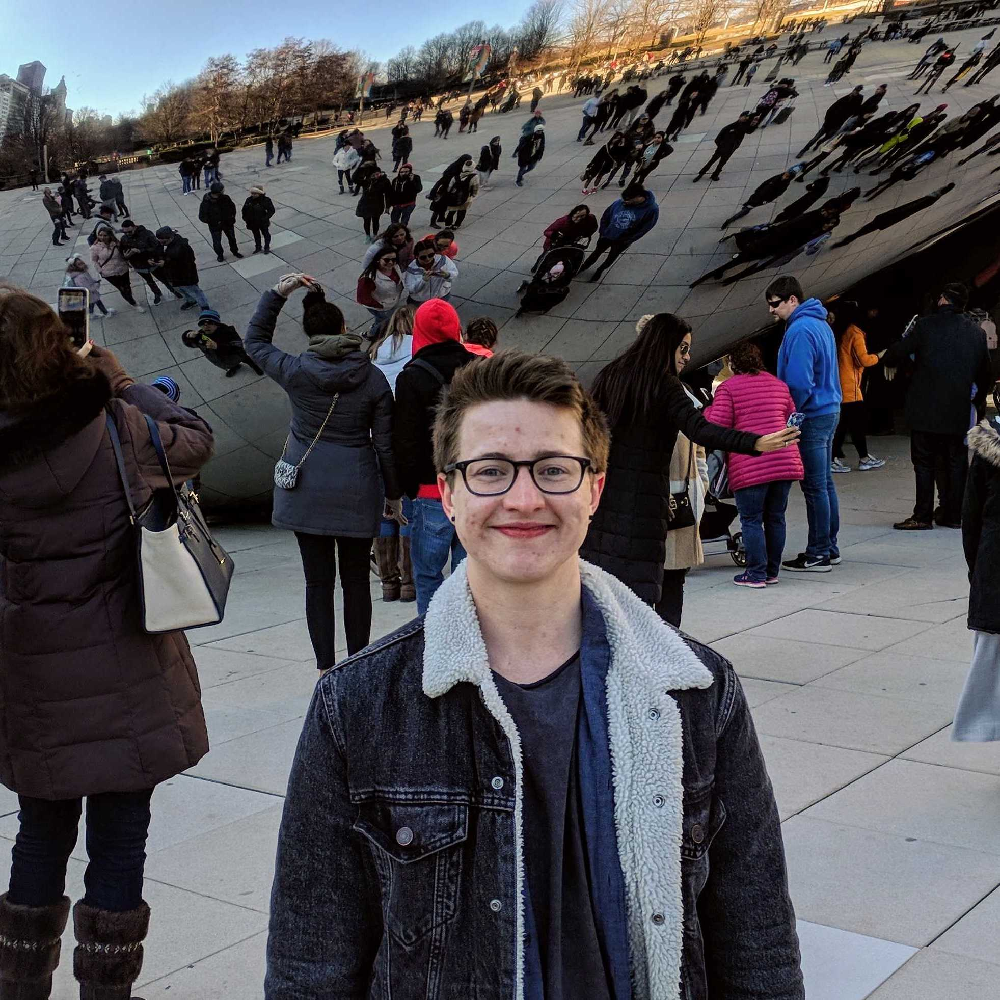

Society for Network Scientists is a student-led organization aimed at promoting Network Science research at the University of Washington. Our goal is to create a tight knit community of students and faculty to discuss and collaborate on various topics concerning Network Science.

If you're interested in joining us, feel free to come to any of our upcoming events listed on this website.

We're on GitHub at [github.com/societynetworkscienceuw](https://github.com/societynetworkscienceuw).
You can sign up for our reading group mailing list [here](http://mailman11.u.washington.edu/mailman/listinfo/social_networks_reading_group) and join our Slack workspace [here](https://join.slack.com/t/uw-sns/signup).

**Officers**

|| Name | Position | Current Program |
|------|------|---------|---------|
|  | [Leo Stewart](https://leostewart.weebly.com/) | President (Barabasi Chief Node) | PhD in Information Science |
|  | [Kishore Vasan](https://kishorevasan.me) | Vice President (Louvain Captain of Community Detection) | Undergraduate in Informatics |
|   | Emily Porter | Social Chair (Watts Foreperson of Bridging Ties) | PhD in Information Science
|  | Lily Deng | Secretary (Bott Manager of Network Embeddings) | Masters in Information Management |
|   | [Kaylea Champion](http://www.kayleachampion.com) | Treasurer (Kleinberg Supervisor of Burst Detection) | PhD in Communication Studies |

